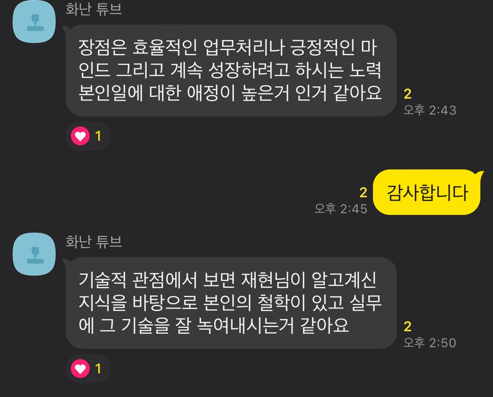
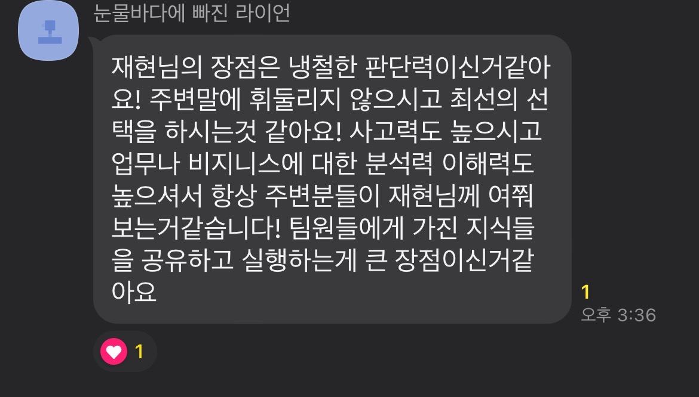

# [과제1]

4개의 질문에 대한 본인의 생각을 적는다.

1. 학습 과정과 현재 자신이 생각하는 역량은?

1. 선택한 직군이 되려는 이유는 무엇인가요?
2. 마음이 끌리는 무엇인가에 몰입해 일정 수준의 결과물을 만들어 낸 경험이 있나요?
3. 우리 회사에 지원하려는 이유는 무엇인가요?

## 1. 학습 과정과 현재 자신이 생각하는 역량은 (1000자 이내)

학습 과정과 현재 자신이 생각하는 역량이 함께 있는 이유는 자신이 가진 역량을 어떻게 학습해 왔냐라는 내용의 전개가 필요할 것 같다. 내가 가진 역량은 무엇인지 생각해 봤는데
솔직히 잘 모르겠다........................ 구지 짜내보자면 아래와 같다.

* 문제 해결 능력이 좋다.

* 비즈니스적 가치를 만들어 낸다.
* 팀에 기여하려고 노력한다.
* 원할한 커뮤니 케이션 능력이 있다.

첫번쨰 항목은 프로그래머로써의 가치를 제공해주지만 나머지 항목들도 프로그래머로써의 역량이라고 할 수 있을까?

할수는 있지만 글로써 풀어나갈 수 있을까? 좀 더 생각해보자

# [과제1]

4개의 질문에 대한 본인의 생각을 적는다.

1. 학습 과정과 현재 자신이 생각하는 역량은?

1. 선택한 직군이 되려는 이유는 무엇인가요?
2. 마음이 끌리는 무엇인가에 몰입해 일정 수준의 결과물을 만들어 낸 경험이 있나요?
3. 우리 회사에 지원하려는 이유는 무엇인가요?

## 1. 학습 과정과 현재 자신이 생각하는 역량은 (1000자 이내)

학습 과정과 현재 자신이 생각하는 역량이 함께 있는 이유는 자신이 가진 역량을 어떻게 학습해 왔냐라는 내용의 전개가 필요할 것 같다. 내가 가진 역량은 무엇인지 생각해 봤는데
솔직히 잘 모르겠다........................ 구지 짜내보자면 아래와 같다.

* 문제 해결 능력이 좋다.
* 비즈니스적 가치를 만들어 낸다.
* 팀에 기여하려고 노력한다.
* 원할한 커뮤니 케이션 능력이 있다.

첫번쨰 항목은 프로그래머로써의 가치를 제공해주지만 나머지 항목들도 프로그래머로써의 역량이라고 할 수 있을까?

할수는 있지만 글로써 풀어나갈 수 있을까? 좀 더 생각해보자

동료 분한테 나의 장점을 여쭤보니 위와 같은 답변을 주셨다. 내용을 좀 뽑아보면

* 효율적인 업무처리
* 긍정적인 마인드
* 계속 성장하려는 노력
* 일에 대한 애정도
* 실무에 기술을 잘 녹아내는 능력

* 냉철한 판단련??????
* 최선의 선택
* 사고력이 높다?????
* 비즈니스에 대한 분석력 이해력이 높다.

## 2. 선택한 직군이 되려는 이유는 무엇인가요? (1000자 이내)
내가 속한 직군은 개발자 그중에서도 백앤드 개발자다.
왜? 백앤드 개발자가 되려고 하는지 그 이유를 기준으로 작성해야 한다.
* 음지에서 일하고 양지를 지향한다 :) 이 어구를 써보고 싶다

## 3. 마음이 끌리는 무엇인가에 몰입해 일정 수준의 결과물을 만들어 낸 경험이 있나요? (1000자 이내)
너무 어렵다..... 

연극을 했던 경험을 써보면 좋지 않을까???

## 4. 우리 회사에 지원하려는 이유는 무엇인가요? (500자 이내)
